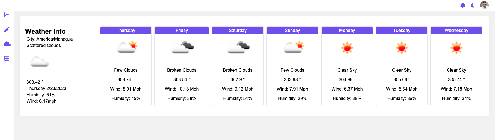

# What is ManageIt?
It is just a small web application created simply to show the strong programming skills that I posses. 

It was built using the MERN stack:
- MongoDb
- Express
- React.js
- Node.js

# Front-end

> The application uses all the following concepts:

- Components
- Templating
- Data Biding
- Data Flow
- State Management
- Back end APIs Connection
- Client Side Routing
- Frontend Builds

>  These concepts are not only the fundamentals of modern front end web development but are also shared among the most popular JavaScript frameworks like Angular, React, and Vue.

# Back-end

> Express.js and Node.js server tier

The next level down is the Express.js server-side framework, running inside a Node.js server. Express.js bills itself as a “fast, unopinionated, minimalist web framework for Node.js,” Express.js has powerful models for URL routing (matching an incoming URL with a server function), and handling HTTP requests and responses.

> MongoDB database tier

This application stores some data like: user profiles, tasks, uploads, etc., MongoDB is just as easy to work with as React, Express, and Node. 
The JSON documents created in the React.js front end are sent to the Express.js server, where they are processed and (assuming they’re valid) stored directly in MongoDB for later retrieval. 

# screenshots 

Graphics

---

Mobile responsive grid

---

Weather API Connection

---

# To view this Web Application in action, please vising the following link: (https://manage-it.antonioflores.me/).